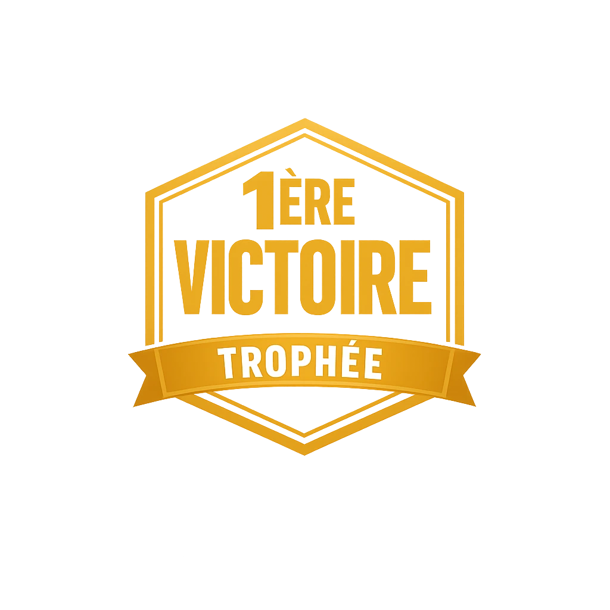
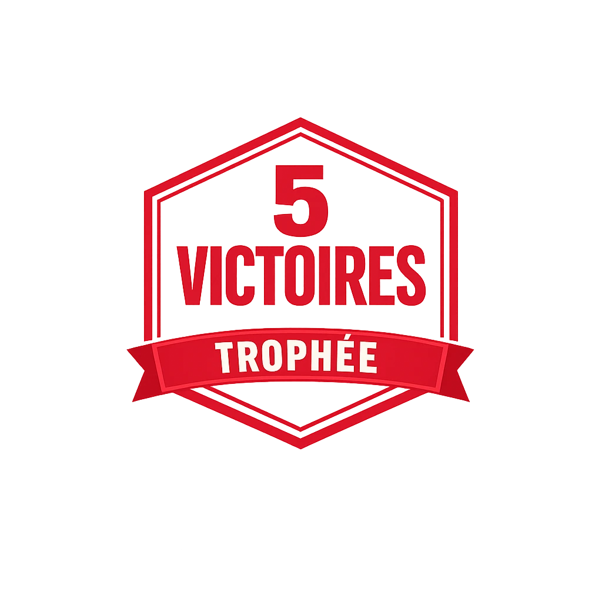
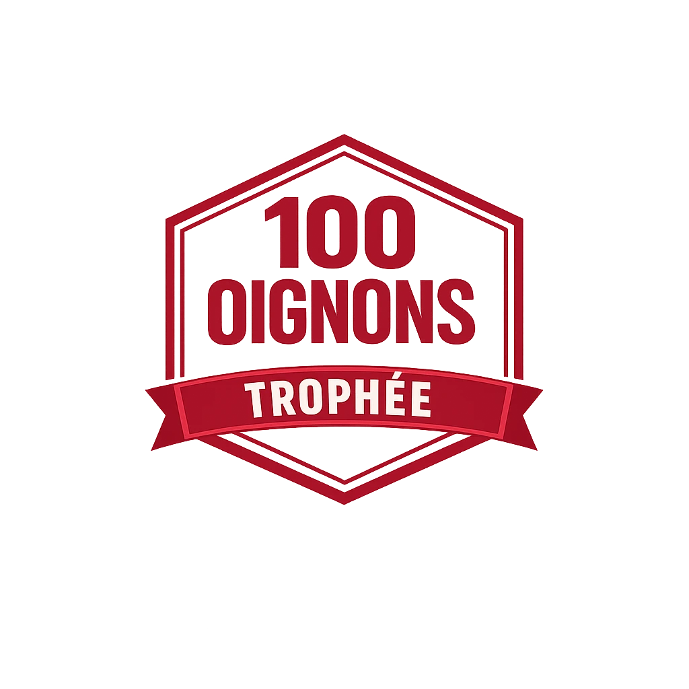
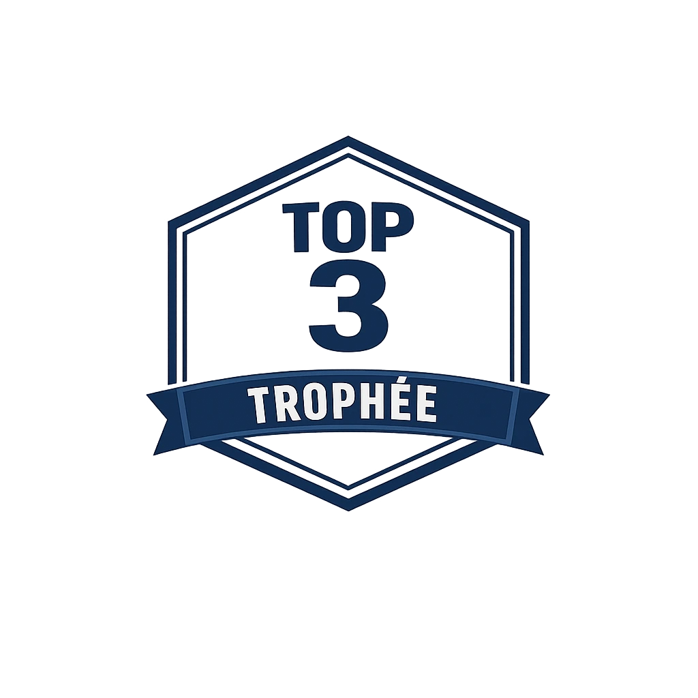
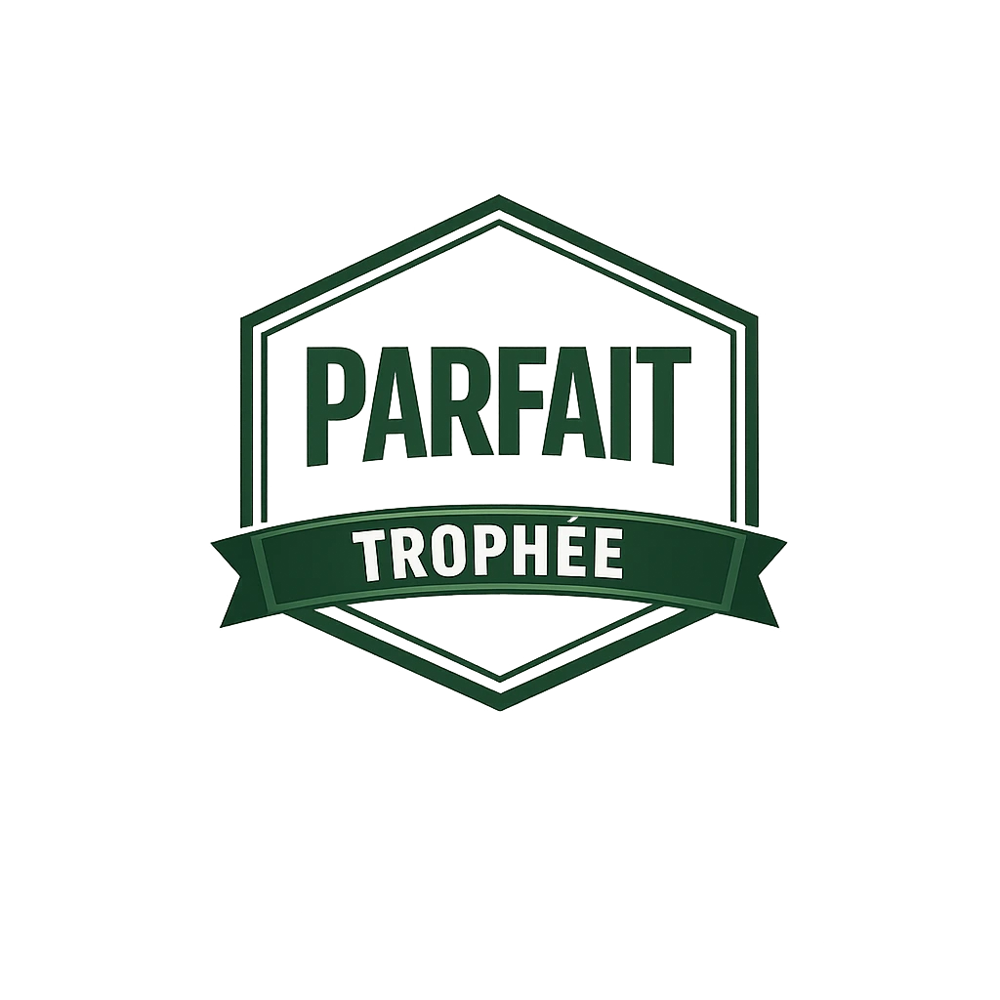

# 🧅 Qui veut gagner des oignons ?

Un quiz interactif inspiré du célèbre jeu télévisé *Qui veut gagner des millions ?*, développé en PHP avec une architecture MVC.

---

## 📋 Description

Le joueur répond à une série de 10 questions à choix multiples, de difficulté croissante. À chaque bonne réponse, il accumule des **oignons** et progresse dans l'échelle des paliers. Deux jokers sont disponibles pour l'aider... mais ne sont pas toujours fiables.

Un mode **entraînement** illimité est également disponible, alimenté par l'API externe [Open Trivia Database](https://opentdb.com).

---

## 🚀 Fonctionnalités

- **Authentification** — inscription, connexion, protection anti-brute force
- **Jeu** — 10 questions, échelle de paliers, 2 jokers (Fou du roi, Pigeon au fermier)
- **Entraînement** — questions infinies via l'API OpenTDB, hors classement
- **Classement** — top 50 des joueurs, podium, progression vers le rang supérieur
- **Profil** — statistiques, historique des parties, trophées, modification des informations
- **Administration** — ajout, modification et suppression de questions
- **Mentions légales** — RGPD, cookies, hébergement

---

## 🛠️ Stack technique

| Couche | Technologie |
|---|---|
| Back-end | PHP 8+ (architecture MVC maison) |
| Base de données | MySQL / MariaDB (PDO) |
| Front-end | HTML5 sémantique, CSS3 (Flexbox, Grid), SCSS |
| JavaScript | Vanilla JS, Fetch API (async/await) |
| API externe | Open Trivia Database (entraînement) |

---

## 📁 Structure du projet

```
Quiz_new/
├── index.php              # Point d'entrée unique
├── .env                   # Variables d'environnement (DB)
├── .htaccess              # Réécriture d'URL
├── config/
│   ├── database.php       # Connexion PDO
│   └── routes.php         # Routeur (switch sur ?action=)
├── app/
│   ├── controllers/       # Logique métier
│   ├── models/            # Requêtes SQL
│   ├── views/             # Templates PHP
│   │   └── layouts/       # Header et footer partagés
│   └── helpers.php        # Fonctions utilitaires
├── public/
│   ├── style.css          # Feuille de styles compilée
│   ├── images/            # Images et icônes
│   ├── fonts/             # Polices Roboto
│   └── js/
│       ├── app.js         # Scripts globaux (menu mobile)
│       ├── game.js        # Logique du jeu et jokers
│       ├── training.js    # Logique de l'entraînement
│       └── profile.js     # Aperçu profil en temps réel
├── scss/                  # Sources SCSS
└── data/
    └── quiz_game.sql      # Schéma et données de démo
```

---

## ⚙️ Installation

### Prérequis
- PHP 8.0+
- MySQL / MariaDB
- Serveur Apache (XAMPP, WAMP, ou autre)

### Étapes

1. **Cloner ou déposer** le projet dans votre dossier web (ex: `htdocs/php/Quiz_new`)

2. **Créer la base de données**
```sql
CREATE DATABASE quiz_game CHARACTER SET utf8mb4 COLLATE utf8mb4_unicode_ci;
```

3. **Importer le schéma**
```bash
mysql -u root -p quiz_game < data/quiz_game.sql
```

4. **Configurer les variables d'environnement** dans `.env`
```ini
DB_HOST=localhost
DB_NAME=quiz_game
DB_USER=root
DB_PASS=
```

5. **Accéder au projet** via `http://localhost/php/Quiz_new/`

### Compte administrateur par défaut
| Champ | Valeur |
|---|---|
| Email | admin@quiz-oignons.fr |
| Mot de passe | Admin1234! |

---

## 🔐 Sécurité

- Mots de passe hashés avec `password_hash()` (bcrypt)
- Requêtes SQL préparées (PDO) — protection contre les injections SQL
- Protection anti-brute force sur la connexion (5 tentatives → blocage 5 min)
- Échappement des sorties avec `htmlspecialchars()`
- Validation des entrées côté serveur

---

## 🏆 Trophées

| Badge | Condition |
|---|---|
|  | Jouer au moins 1 partie |
|  | Jouer au moins 5 parties |
|  | Récolter 100 oignons |
|  | Être dans le top 3 du classement |
|  | Répondre correctement aux 10 questions |

---

## 👩‍💻 Auteure

**Linda Hillairet** — Projet pédagogique réalisé dans le cadre d'une formation Développeur Web Full Stack.
